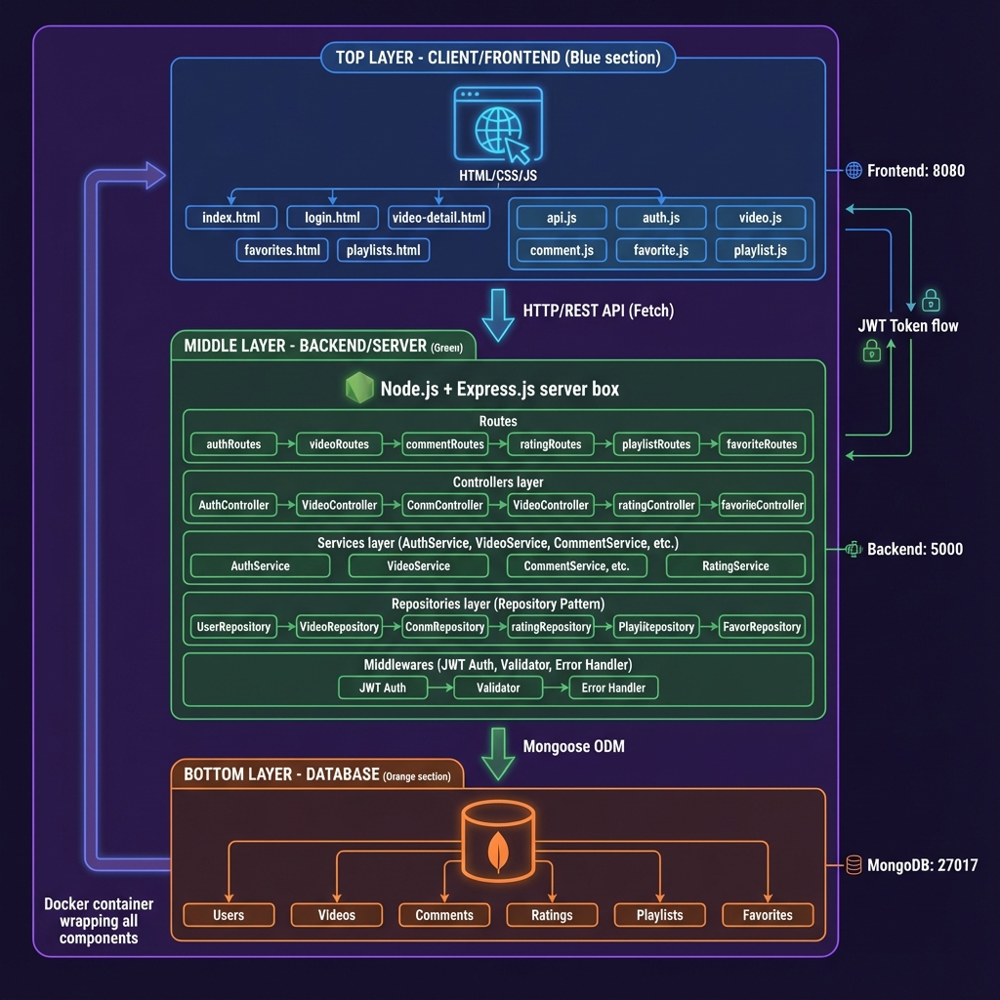
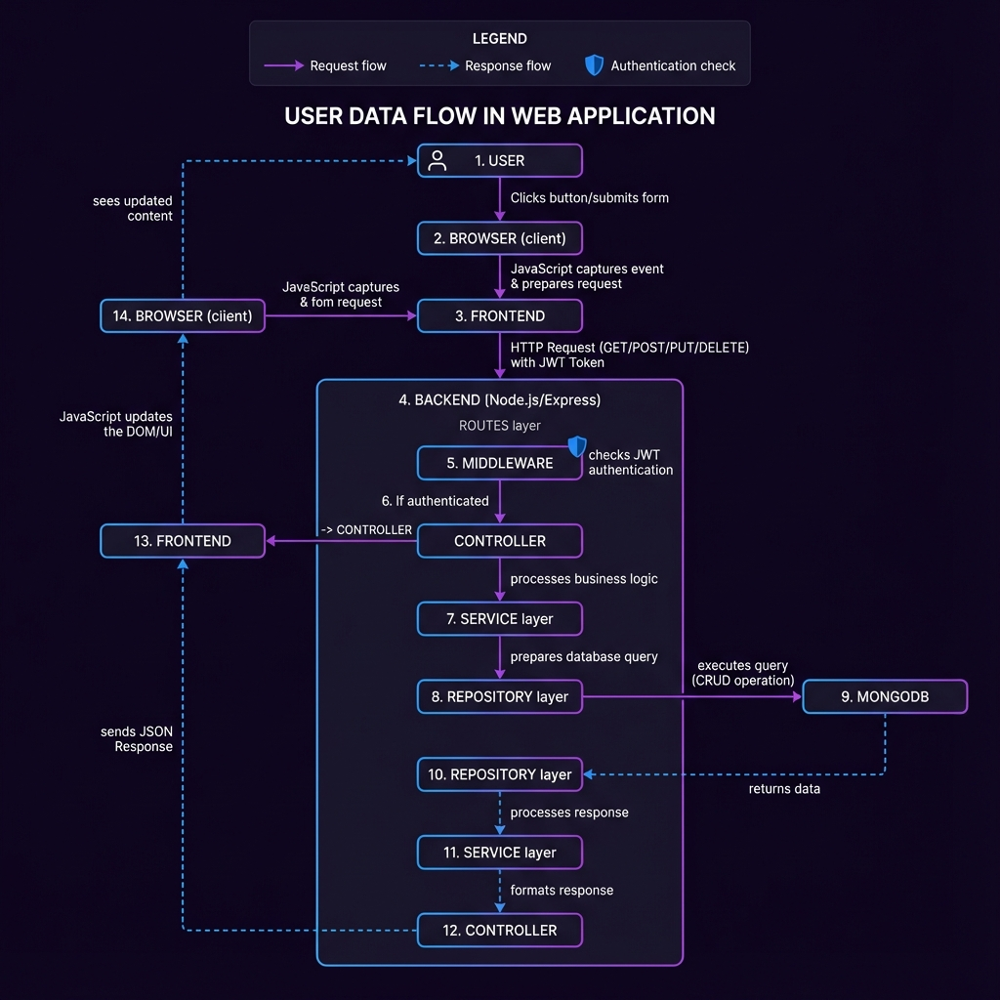

# HBO MAX 影視討論平台

> 一個功能完整的全端影音社群分享平台，提供用戶瀏覽、管理、評論、評分影片內容，並實現前後端完整整合。



## 專案主題與目標

### 專案主題
本專案為「HBO MAX 影視討論平台」，是一個以影視內容為核心的社群互動平台。使用者可以瀏覽影片、發表評論、進行評分，並管理個人的收藏清單與播放清單。

### 核心目標
1. **完整的 CRUD 功能** - 實現用戶、影片、評論、評分、播放清單、收藏的增刪改查操作
2. **安全的用戶認證** - 使用 JWT 實現安全的身份驗證與授權機制
3. **設計模式應用** - 實踐 Repository、Service、Singleton 等設計模式
4. **前後端分離** - 清晰的架構分層，提高可維護性與可擴展性
5. **Docker 容器化** - 簡化部署流程，確保環境一致性

### 目標使用者
- 影視愛好者：瀏覽、評論、收藏影片
- 內容創作者：上傳、管理影片內容
- 平台管理員：管理用戶與影片內容

---

## 技術選擇原因

### 後端技術

#### Node.js + Express.js
**選擇原因**:
- **JavaScript 全端開發** - 前後端使用相同語言，降低學習成本
- **非阻塞 I/O** - 高效處理大量並發請求，適合即時應用
- **豐富的生態系統** - NPM 套件豐富，開發效率高
- **RESTful API** - Express 框架簡潔易用，路由設計清晰

#### MongoDB + Mongoose
**選擇原因**:
- **靈活的文檔結構** - Schema-less 設計適合快速迭代開發
- **易於擴展** - 水平擴展能力強，適合大量資料
- **JSON 原生支援** - 與 JavaScript 完美整合
- **Mongoose ODM** - 提供資料驗證、關係建模、中介軟體等功能

#### JWT (JSON Web Token)
**選擇原因**:
- **無狀態認證** - 不需要 session 儲存，易於擴展
- **跨域支援** - 適合前後端分離架構
- **安全性高** - Token 加密，防止偽造
- **自包含性** - Token 包含用戶資訊，減少資料庫查詢

### 前端技術

#### 原生 HTML/CSS/JavaScript
**選擇原因**:
- **輕量快速** - 無框架依賴，載入速度快
- **學習曲線低** - 基礎技術，易於理解與維護
- **完全控制** - 不受框架限制，完全掌控程式碼
- **瀏覽器相容性佳** - 原生 API 支援良好

#### Fetch API
**選擇原因**:
- **現代化** - 取代傳統 XMLHttpRequest
- **Promise-based** - 支援 async/await，程式碼簡潔
- **內建支援** - 無需額外套件
- **易於錯誤處理** - 統一的錯誤處理機制

### 部署技術

#### Docker + Docker Compose
**選擇原因**:
- **環境一致性** - 開發、測試、生產環境完全一致
- **快速部署** - 一鍵啟動所有服務
- **服務隔離** - 各服務獨立運行，互不干擾
- **易於擴展** - 可輕鬆增加或移除服務

---

## 系統架構說明

### 整體架構圖


### 三層架構設計

#### 1. 前端層 (Presentation Layer)
```
Browser (Port 8080)
├── HTML Pages (6個頁面)
│   ├── index.html - 首頁
│   ├── login.html - 登入頁
│   ├── register.html - 註冊頁
│   ├── video-detail.html - 影片詳情
│   ├── favorites.html - 收藏清單
│   └── playlists.html - 播放清單
├── CSS (HBO MAX 深色主題)
│   └── styles.css - 統一樣式
└── JavaScript Modules (模組化設計)
    ├── api.js - API 請求工具
    ├── auth.js - 認證管理
    ├── video.js - 影片功能
    ├── comment.js - 評論功能
    ├── favorite.js - 收藏功能
    ├── playlist.js - 播放清單功能
    └── app.js - 應用程式主程式
```

#### 2. 後端層 (Application Layer)
```
Node.js + Express (Port 5000)
├── Routes (路由層)
│   ├── authRoutes - 認證路由
│   ├── videoRoutes - 影片路由
│   ├── commentRoutes - 評論路由
│   ├── ratingRoutes - 評分路由
│   ├── playlistRoutes - 播放清單路由
│   └── favoriteRoutes - 收藏路由
├── Middlewares (中介軟體)
│   ├── authMiddleware - JWT 驗證
│   ├── errorHandler - 錯誤處理
│   └── validator - 輸入驗證
├── Controllers (控制器層)
│   └── 處理 HTTP 請求與回應
├── Services (服務層 - 業務邏輯)
│   ├── AuthService - 認證邏輯
│   ├── VideoService - 影片業務邏輯
│   ├── CommentService - 評論邏輯
│   ├── RatingService - 評分邏輯
│   ├── PlaylistService - 播放清單邏輯
│   └── FavoriteService - 收藏邏輯
└── Repositories (資料存取層)
    ├── UserRepository
    ├── VideoRepository
    ├── CommentRepository
    ├── RatingRepository
    ├── PlaylistRepository
    └── FavoriteRepository
```

#### 3. 資料庫層 (Data Layer)
```
MongoDB (Port 27018)
├── users - 用戶資料
├── videos - 影片資料
├── comments - 評論資料
├── ratings - 評分資料
├── playlists - 播放清單
└── favorites - 收藏紀錄
```

### 設計模式應用

#### Repository Pattern (資料存取層)
**目的**: 將資料庫操作邏輯封裝，提供統一的資料存取介面

**優點**:
- 業務邏輯與資料層解耦
- 易於測試（可模擬資料層）
- 統一的資料操作介面
- 便於更換資料庫實作

**實作範例**:
```javascript
class VideoRepository {
  async findAll(filter = {}, options = {}) {
    return await Video.find(filter, null, options);
  }
  
  async findById(id) {
    return await Video.findById(id);
  }
  
  async create(data) {
    return await Video.create(data);
  }
}
```

#### Service Pattern (業務邏輯層)
**目的**: 將複雜的業務邏輯從 Controller 分離

**優點**:
- 程式碼可重用性高
- 易於單元測試
- 職責單一，易於維護
- 業務邏輯集中管理

**實作範例**:
```javascript
class VideoService {
  async getVideoWithRating(id) {
    const video = await this.videoRepository.findById(id);
    const avgRating = await this.ratingRepository.calculateAverage(id);
    return { ...video.toObject(), averageRating: avgRating };
  }
}
```

#### Singleton Pattern (資料庫連線)
**目的**: 確保整個應用只有一個 MongoDB 連線實例

**優點**:
- 避免資源浪費
- 統一連線管理
- 提高效能

### 資料流程圖



**使用者操作流程**:
1. 使用者在瀏覽器執行操作 (點擊、提交表單)
2. JavaScript 捕獲事件，呼叫 API 模組
3. 發送 HTTP 請求 (含 JWT Token)
4. 後端路由接收請求
5. 中介軟體驗證 JWT
6. 控制器呼叫服務層
7. 服務層處理業務邏輯
8. 資料存取層查詢 MongoDB
9. 資料層返回結果
10. 格式化回應並返回前端
11. JavaScript 更新 UI
12. 使用者看到更新後的內容

---

## 🚀 安裝與執行指引

### 環境需求

- **Node.js**: v18.0.0 或更高版本
- **MongoDB**: v7.0 或更高版本 (或使用 Docker)
- **Docker**: v20.10 或更高版本 (選擇性)
- **Docker Compose**: v2.0 或更高版本 (選擇性)

### 方法 1: 使用 Docker Compose（推薦）

這是最簡單的方式，會自動啟動前端、後端和資料庫。

#### 步驟 1: 確認環境
```bash
# 檢查 Docker 版本
docker --version

# 檢查 Docker Compose 版本
docker-compose --version
```

#### 步驟 2: 下載專案
```bash
git clone <repository-url>
cd finalexam
```

#### 步驟 3: 啟動所有服務
```bash
# 啟動所有容器
docker-compose up -d

# 查看容器狀態
docker-compose ps

# 查看日誌
docker-compose logs -f
```

#### 步驟 4: 訪問應用
- **前端**: http://localhost:8080
- **後端 API**: http://localhost:5000
- **MongoDB**: localhost:27018

#### 步驟 5: 停止服務
```bash
# 停止所有容器
docker-compose down

# 停止並刪除資料卷（會清除所有資料）
docker-compose down -v
```

### 方法 2: 本地開發環境

適合需要頻繁修改程式碼的開發情境。

#### 步驟 1: 安裝 MongoDB

**Windows**:
1. 下載 MongoDB Community Server
2. 安裝並啟動 MongoDB 服務

**macOS** (使用 Homebrew):
```bash
brew tap mongodb/brew
brew install mongodb-community
brew services start mongodb-community
```

**Linux** (Ubuntu):
```bash
sudo apt-get install mongodb
sudo systemctl start mongodb
```

#### 步驟 2: 設定後端

```bash
# 進入後端資料夾
cd server

# 安裝依賴套件
npm install

# 建立 .env 檔案
cp .env.example .env

# 編輯 .env 檔案，設定環境變數
# MONGODB_URI=mongodb://localhost:27017/hbomax_platform
# PORT=5000
# JWT_SECRET=your_secret_key
# JWT_EXPIRE=7d

# 啟動後端伺服器
npm start

# 或使用開發模式（自動重啟）
npm run dev
```

#### 步驟 3: 初始化資料庫

```bash
# 連接到 MongoDB
mongosh

# 執行初始化腳本（複製 mongo-init/init-db.js 的內容並貼上）
```

#### 步驟 4: 啟動前端

```bash
# 方式 1: 使用 http-server
cd client
npx http-server -p 8080

# 方式 2: 使用 Python
cd client
python -m http.server 8080

# 方式 3: 使用 VS Code Live Server 擴充套件
# 開啟 client/index.html 並點擊 "Go Live"
```

#### 步驟 5: 訪問應用
- **前端**: http://localhost:8080
- **後端 API**: http://localhost:5000

---

## 專案結構

```
finalexam/
├── client/                     # 前端應用
│   ├── css/
│   │   └── styles.css         # HBO MAX 深色主題樣式
│   ├── js/
│   │   ├── api.js             # API 請求工具
│   │   ├── auth.js            # 認證管理
│   │   ├── video.js           # 影片功能
│   │   ├── comment.js         # 評論功能
│   │   ├── favorite.js        # 收藏功能
│   │   ├── playlist.js        # 播放清單功能
│   │   └── app.js             # 主程式
│   ├── index.html             # 首頁
│   ├── login.html             # 登入頁
│   ├── register.html          # 註冊頁
│   ├── video-detail.html      # 影片詳情頁
│   ├── favorites.html         # 收藏頁
│   └── playlists.html         # 播放清單頁
├── server/                     # 後端應用
│   ├── src/
│   │   ├── config/            # 配置檔案
│   │   │   ├── database.js    # 資料庫連線 (Singleton)
│   │   │   └── jwt.js         # JWT 配置
│   │   ├── models/            # Mongoose Models
│   │   │   ├── User.js
│   │   │   ├── Video.js
│   │   │   ├── Comment.js
│   │   │   ├── Rating.js
│   │   │   ├── Playlist.js
│   │   │   └── Favorite.js
│   │   ├── repositories/      # Repository Pattern
│   │   │   ├── UserRepository.js
│   │   │   ├── VideoRepository.js
│   │   │   ├── CommentRepository.js
│   │   │   ├── RatingRepository.js
│   │   │   ├── PlaylistRepository.js
│   │   │   └── FavoriteRepository.js
│   │   ├── services/          # Service Pattern
│   │   │   ├── AuthService.js
│   │   │   ├── VideoService.js
│   │   │   ├── CommentService.js
│   │   │   ├── RatingService.js
│   │   │   ├── PlaylistService.js
│   │   │   └── FavoriteService.js
│   │   ├── controllers/       # 控制器
│   │   │   ├── authController.js
│   │   │   ├── videoController.js
│   │   │   ├── commentController.js
│   │   │   ├── ratingController.js
│   │   │   ├── playlistController.js
│   │   │   └── favoriteController.js
│   │   ├── middlewares/       # 中介軟體
│   │   │   ├── authMiddleware.js
│   │   │   ├── errorHandler.js
│   │   │   └── validator.js
│   │   ├── routes/            # 路由
│   │   │   ├── authRoutes.js
│   │   │   ├── videoRoutes.js
│   │   │   ├── commentRoutes.js
│   │   │   ├── ratingRoutes.js
│   │   │   ├── playlistRoutes.js
│   │   │   └── favoriteRoutes.js
│   │   ├── utils/             # 工具函數
│   │   │   ├── responseFormatter.js
│   │   │   └── constants.js
│   │   └── app.js             # Express 主程式
│   ├── .env                   # 環境變數
│   ├── .gitignore            # Git 忽略檔案
│   ├── Dockerfile            # Docker 映像檔
│   └── package.json          # NPM 套件配置
├── tests/                     # 測試檔案
│   ├── api.http              # HTTP API 測試
│   ├── auth.test.js          # 認證單元測試
│   └── test.md               # 測試指南
├── documentation/             # 文件
│   ├── api-spec.md           # API 規格文件
│   ├── architecture.png      # 系統架構圖
│   └── flowchart.png         # 資料流程圖
├── mongo-init/               # MongoDB 初始化
│   └── init-db.js           # 初始化腳本
├── docker-compose.yml        # Docker Compose 配置
├── nginx.conf               # Nginx 配置
└── README.md                # 專案說明文件
```

---

## 功能特色

### 用戶功能
- **註冊與登入** - JWT Token 認證，安全可靠
- **瀏覽影片** - 支援分類篩選、搜尋、分頁
- **影片詳情** - 查看完整資訊、播放影片
- **評論系統** - 發表、編輯、刪除評論
- **評分系統** - 1-10 分評分，顯示平均分
- **收藏清單** - 一鍵收藏喜歡的影片
- **播放清單** - 建立個人播放清單

### 管理員功能
- **影片管理** - 新增、編輯、刪除影片
- **內容審核** - 管理用戶評論
- **權限控制** - 管理員專屬權限

### 技術特色
- **響應式設計** - 支援手機、平板、桌面
- **HBO MAX 主題** - 深色主題，視覺效果佳
- **RESTful API** - 標準化 API 設計
- **設計模式** - Repository、Service、Singleton
- **Docker 部署** - 一鍵啟動，環境一致

---

## API 端點總覽

完整的 API 規格請參閱 [API 規格文件](documentation/api-spec.md)

### 認證 API
- `POST /api/auth/register` - 用戶註冊
- `POST /api/auth/login` - 用戶登入
- `GET /api/auth/me` - 取得當前用戶資訊

### 影片 API
- `GET /api/videos` - 取得所有影片（支援分頁、篩選、搜尋）
- `GET /api/videos/:id` - 取得影片詳情
- `POST /api/videos` - 新增影片（需認證）
- `PUT /api/videos/:id` - 更新影片（需認證、權限）
- `DELETE /api/videos/:id` - 刪除影片（需認證、權限）
- `PUT /api/videos/:id/view` - 增加觀看次數

### 評論 API
- `GET /api/comments/video/:videoId` - 取得影片評論
- `POST /api/comments` - 新增評論（需認證）
- `PUT /api/comments/:id` - 更新評論（需認證、權限）
- `DELETE /api/comments/:id` - 刪除評論（需認證、權限）

### 評分 API
- `GET /api/ratings/video/:videoId` - 取得影片平均評分
- `POST /api/ratings` - 新增/更新評分（需認證）
- `GET /api/ratings/video/:videoId/user` - 取得用戶評分

### 播放清單 API
- `GET /api/playlists` - 取得用戶播放清單（需認證）
- `POST /api/playlists` - 新增播放清單（需認證）
- `PUT /api/playlists/:id` - 更新播放清單（需認證、權限）
- `DELETE /api/playlists/:id` - 刪除播放清單（需認證、權限）
- `POST /api/playlists/:id/videos` - 新增影片到清單
- `DELETE /api/playlists/:id/videos/:videoId` - 移除影片

### 收藏 API
- `GET /api/favorites` - 取得用戶收藏（需認證）
- `POST /api/favorites` - 新增收藏（需認證）
- `DELETE /api/favorites/:videoId` - 移除收藏（需認證）

---

## 測試帳號

### 管理員帳號
- **Email**: admin@hbomax.com
- **Password**: admin123
- **權限**: 完整管理權限

**重要提醒**: 請在生產環境中更改預設密碼！

---

## 測試

### API 測試
使用 VS Code REST Client 擴充套件：
```bash
# 開啟測試檔案
code tests/api.http
```

### 單元測試
```bash
cd server
npm install --save-dev jest supertest
npm test
```

詳細測試指南請參閱 [測試文件](tests/test.md)

---

## 相關文件

- [API 規格文件](documentation/api-spec.md) - 完整的 API 端點說明
- [系統架構圖](documentation/architecture.png) - 視覺化系統架構
- [資料流程圖](documentation/flowchart.png) - 使用者操作流程
- [測試指南](tests/test.md) - 測試方法與範例

---

## 環境變數

在 `server/.env` 檔案中設定：

```env
# 伺服器配置
PORT=5000
NODE_ENV=production

# 資料庫配置
MONGODB_URI=mongodb://mongodb:27017/hbomax_platform

# JWT 配置
JWT_SECRET=your_super_secret_key_change_in_production
JWT_EXPIRE=7d
```

---

**版本**: v1.0.0  
**最後更新**: 2025-12-29
